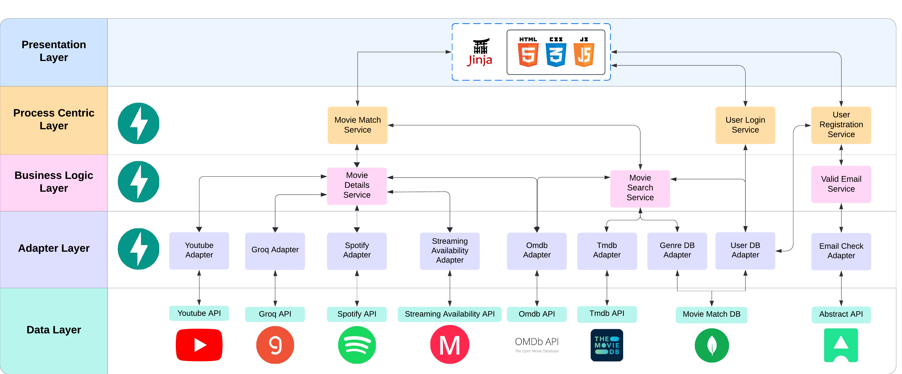

# MovieMatch 🎬✨

## A service-oriented web application that matches you with your favorite movie.

This project aims to create a web application that enables users to search for movies and get recommendations based on their preferences.

## Table of Contents

- [Endpoints Documentation](#endpoints-documentation)
- [Architecture Diagram](#architecture-diagram)
- [How to Run](#how-to-run)
- [Features](#features)
- [Architecture](#architecture)
- [Technologies](#technologies)
- [Response Structure](#response-structure)
- [Future Improvements](#future-improvements)

## Endpoints Documentation 📚

Documentation of the endpoints can be found inside the file `docs.json` in the root directory of the project.
Because of FastAPI automatic documentation, you can also access the documentation by running the project and accessing the `/docs` endpoint for each docker container.

## Architecture Diagram 🏗️



## How to Run 🚀

To run the application, you need to have Docker and Docker Compose installed on your machine.

After installing Docker and Docker Compose, you can run the following command to start the application:

```bash
docker-compose up --build
```
This command will build the images and start the containers for the frontend, backend, and database.

After the containers are up and running, you can access the frontend by going to [http://localhost](http://localhost) (on port 80) on your browser.

## Features 🌟

+ Suggests movies based on user genre preferences
+ Displays movie details including trailer, spotify playlist, trivia AI generated quiz and streaming availability in your favorite platforms (Netflix, Amazon Prime, Disney+ and HBO Max)
+ Use both internal and external data sources to provide the best recommendations
+ Scalable service-oriented architecture that can be easily extended to include more services
+ Docker Compose used to deploy the multi-container application
+ RESTful API with FastAPI

## Architecture 🏛️

The architecture is divided into four layers:

1. **Data Layer**: Contains the database and external data sources used by the services.
2. **Adapter Layer**: Filters and standardizes data from external APIs.
3. **Business Logic Layer**:  Contains all of the necessary processing logic for the application.
4. **Process Centric Layer**: Provides High-level services to the user.

In total, **15 services** were built across the 4 layers. Docker compose is used to define and deploy the multi-container application.

## Technologies 🛠️

  


 


## Response structure 📦

Througout the project, all the responses are structured as follows:

```json
{
    "status": "success or error",
    "message": "A brief message about the response",
    "data": { 
        "key": "value",
    } 
}
```

Example of a successfull response, when retrieving movie details:

```json
{
  "status": "success",
  "message": "Movie details retrieved successfully",
  "data": {
    "Title": "The Matrix",
    "Year": "1999",
    "imdbID": "tt0133093",
    "Type": "movie",
    "Director": "Lana Wachowski, Lilly Wachowski",
    "Genre": "Action, Sci-Fi",
    "Poster": "https://m.media-amazon.com/images/M/MV5BN2NmN2VhMTQtMDNiOS00NDlhLTliMjgtODE2ZTY0ODQyNDRhXkEyXkFqcGc@._V1_SX300.jpg",
    "imdbRating": "8.7"
  }
}
```

Example of an error response when the IMDb ID is incorrect:

```json
{
  "status": "error",
  "message": "Incorrect IMDb ID."
}
```

## Future improvements 🔮

+ Improving session/token management leveraging sessions.
+ Implementing a movie caching system to improve the performance of the application.
+ Adding more services to provide more information about the movies.
+ Testing deployment on a cloud platform like AWS or Azure.
