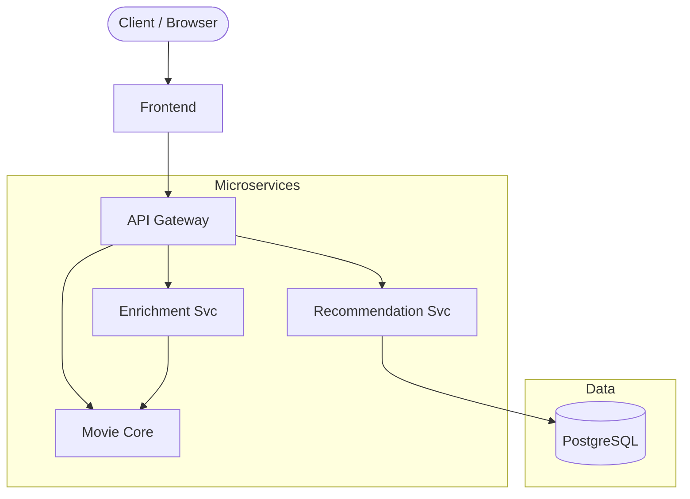

# Movie-Match 🎬

This project started as a university project and was later refactored into a personal training ground for exploring different microservice architectures and technologies. It's built primarily with Python and FastAPI, chosen simply because they looked fun to learn and use!

## Architecture Overview


```mermaid
graph TD
    Client([Client / Browser]) --> Frontend
    Frontend --> Gateway[API Gateway]
    
    subgraph Microservices
        Gateway --> Core[Movie Core]
        Gateway --> Rec[Recommendation Svc]
        Gateway --> Enrich[Enrichment Svc]
    end
    
    subgraph Data
        Rec --> DB[(PostgreSQL)]
        Enrich --> Core
    end
```

### Services Description

To keep the architecture modular and separated by concern, the application is split into the following services:

* **API Gateway (`api-gateway`)**: The single entry point for all client requests, responsible for routing traffic and aggregating data from the backend microservices.
* **Movie Core (`movie-core`)**: An adapter service for The Movie Database (TMDB). It handles external API communication, validates responses, and serves core movie details and discovery data (no local database access).
* **Recommendation Service (`recommendation-svc`)**: The database-backed engine of the platform. It manages the local catalog in PostgreSQL and generates recommendations by mapping user "vibes" and moods to specific genres.
* **Enrichment Service (`enrichment-svc`)**: A data-enrichment service that fetches extra multimedia metadata—like trailers from YouTube, soundtracks from Spotify, and streaming platform availability.
* **Frontend (`frontend`)**: The user-facing web interface for interacting with the platform.

## Tech Stack

- **Backend:** Python, FastAPI
- **Database:** PostgreSQL
- **Infrastructure:** Docker & Docker Compose

## Quickstart

```bash
docker compose up -d
```
